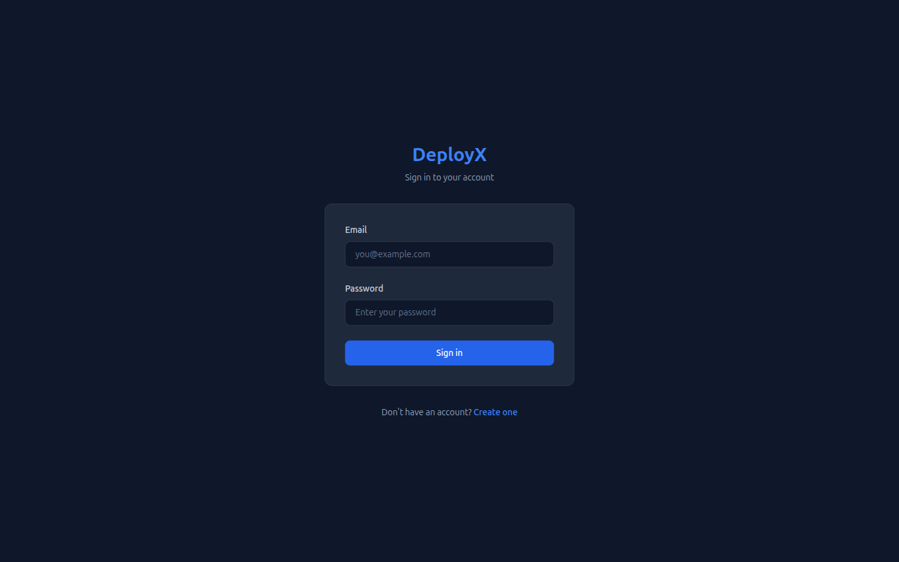
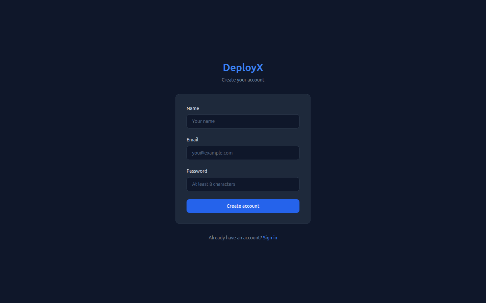
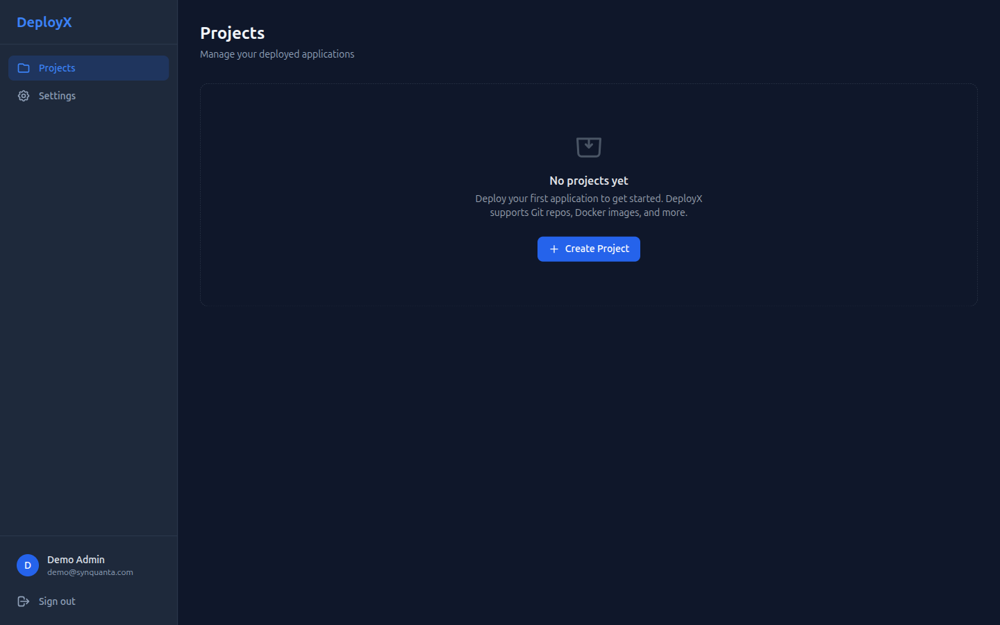
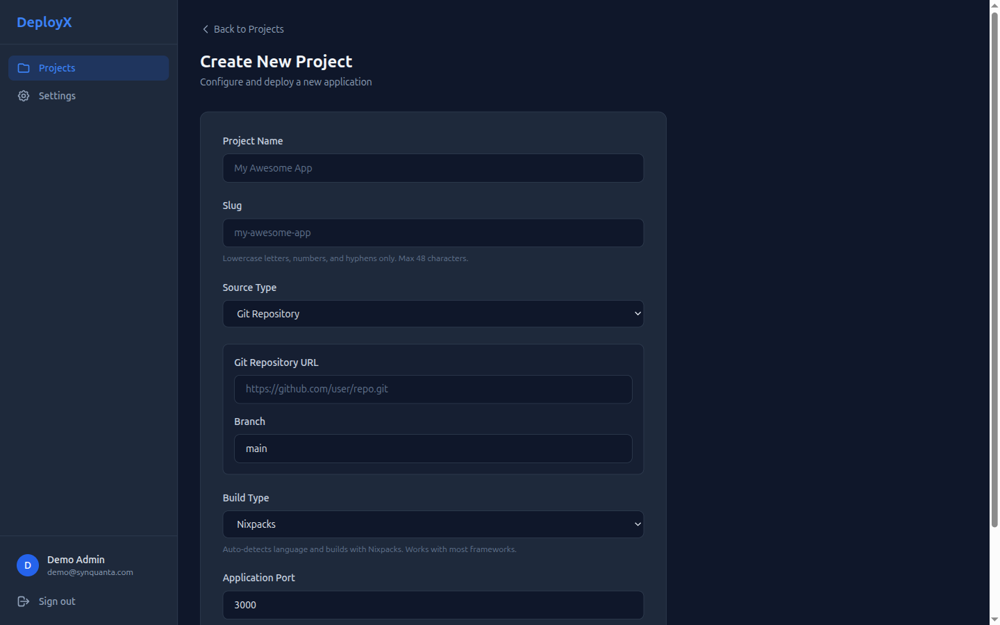
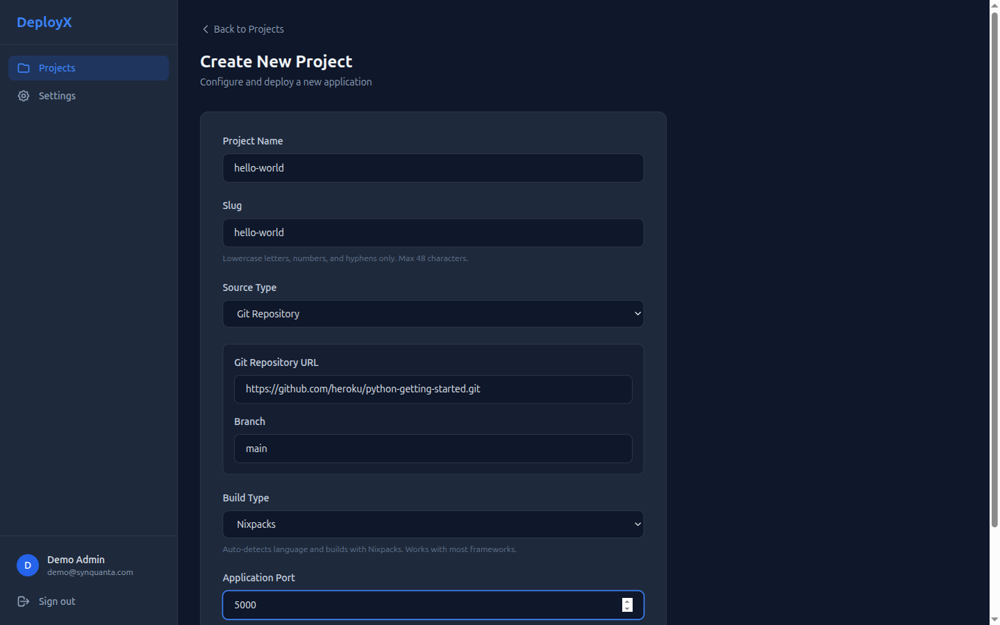
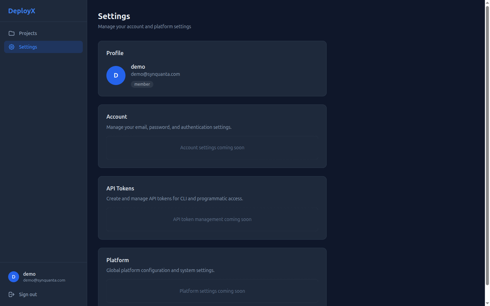

# DeployX

**Lightweight, open-source, self-hosted PaaS. Deploy web apps on a single VPS.**

[](LICENSE)
[](https://nodejs.org/)
[](https://www.typescriptlang.org/)
[](CONTRIBUTING.md)

---

## What is DeployX?

DeployX is a self-hosted alternative to Railway, Render, and Coolify. It lets you deploy and manage multiple web applications on a single VPS with a clean dashboard and API -- no vendor lock-in, no per-seat pricing, no usage-based surprises.

- **Affordable hosting.** Run multiple apps on a single $6/month VPS instead of paying per-app on managed platforms.
- **Minimal overhead.** ~200MB memory footprint vs 2GB+ for alternatives like Coolify.
- **Security-first design.** No shell string interpolation, hardened containers, encrypted secrets, Docker socket proxy isolation.
- **Multi-language support.** Deploy Node.js, Python, Go, Rust, Ruby, and more via Nixpacks auto-detection.
- **Automatic SSL.** Traefik v3 handles TLS certificates via Let's Encrypt with zero configuration.
- **Simple deployment.** Push a git repo, Docker image, or tarball. DeployX builds and routes it automatically.

---

## Screenshots

| | |
|---|---|
|  |  |
| Sign-in screen | Account creation |
|  |  |
| Projects list (empty state) | New-project form |
|  |  |
| New-project form (filled) | Settings |

> Dashboard built with SvelteKit (Svelte 5 runes), Tailwind, dark surface palette. All screenshots from local dev mode.

---

## Quick Start (VPS)

Deploy DeployX on a fresh VPS with a single command:

```bash
curl -fsSL https://raw.githubusercontent.com/iEmmanuel104/deployx/main/infra/installer/install.sh | sudo bash
```

This single command:

1. Installs Docker, Node.js, pnpm, and Nixpacks
2. Generates encryption keys and JWT secrets
3. Creates a system user and required directories
4. Runs database migrations
5. Starts all services via Docker Compose
6. Verifies health and prints the dashboard URL

**Supported operating systems:** Ubuntu 22.04, Ubuntu 24.04, Debian 12

For non-interactive installation (CI/CD or scripted setup):

```bash
PLATFORM_DOMAIN=deployx.example.com ACME_EMAIL=you@email.com \
  curl -fsSL https://raw.githubusercontent.com/iEmmanuel104/deployx/main/infra/installer/install.sh | sudo bash
```

### System Requirements

| Resource | Minimum | Recommended |
|----------|---------|-------------|
| **OS** | Ubuntu 22.04 / 24.04, Debian 12 | Ubuntu 24.04 |
| **CPU** | 1 vCPU | 2+ vCPU |
| **RAM** | 1 GB | 2+ GB |
| **Storage** | 20 GB | 40+ GB (Docker images take space) |
| **Network** | Public IPv4 | Public IPv4 + domain with DNS access |

**Not supported for production:** Windows, macOS, CentOS, Fedora, Arch, Alpine.

**Local development** (any OS): Use Docker Desktop with `docker-compose.dev.yml` -- works on Windows, macOS, and Linux.

---

## Quick Start (Local Development)

```bash
git clone https://github.com/iEmmanuel104/deployx.git
cd deployx
pnpm install
cp .env.example .env  # Then fill in secrets (see Environment Variables below)
pnpm db:generate && pnpm db:migrate
pnpm dev  # API on :3001, Dashboard on :3000
```

Or with Docker:

```bash
docker network create proxy-network
docker compose -f docker-compose.dev.yml up --build
# Dashboard: http://localhost:3000
# API: http://localhost:3001
```

> **Dev mode note:** the API does not currently auto-load `.env` (no `dotenv` import in `apps/api/src/index.ts`). For `pnpm dev` you'll need to either `export` the variables in your shell, run packages individually (`pnpm -F @deployx/api dev` with env prefixed), or wait on the upcoming env-loader fix tracked in the roadmap below.

---

## Deploy Your First App

After DeployX is running on your VPS, deploy your first project from the CLI:

```bash
# 1. Install the CLI (one-time)
npm install -g @deployx/cli

# 2. Authenticate against your DeployX instance
deployx login --server https://deployx.example.com
# Prompts for email + password (the admin you created during install)

# 3. Create a project from a git repo
deployx projects create \
  --name "hello-world" \
  --slug "hello-world" \
  --git "https://github.com/heroku/python-getting-started.git" \
  --branch "main" \
  --build "nixpacks" \
  --port 5000

# 4. Set environment variables
deployx env set DATABASE_URL "postgres://..."
deployx env set SECRET_KEY "$(openssl rand -hex 32)"

# 5. Trigger the first deploy
deployx deploy

# 6. Attach a custom domain (optional — the default subdomain
#    <slug>.your-platform-domain is created automatically)
deployx domains add hello-world.example.com

# 7. Verify
curl -I https://hello-world.your-platform-domain
```

You can do all of the above from the web dashboard at `https://${PLATFORM_DOMAIN}` instead. The CLI is mostly useful for scripting and CI.

---

## Environment Variables

Copy `.env.example` to `.env` and configure:

| Variable | Required | Default | Description |
|---|---|---|---|
| `PLATFORM_DOMAIN` | Yes | -- | Your domain (e.g., `deployx.example.com`) |
| `ENCRYPTION_KEY` | Yes | -- | 64 hex chars for AES-256-GCM. Generate: `openssl rand -hex 32` |
| `JWT_SECRET` | Yes | -- | 64 hex chars for JWT signing. Generate: `openssl rand -hex 32` |
| `DB_PATH` | No | `/data/platform.db` | SQLite database file path |
| `PORT` | No | `3001` | API server port |
| `NODE_ENV` | No | `production` | Environment (`production` or `development`) |
| `ACME_EMAIL` | No | -- | Email for Let's Encrypt SSL certificate registration |
| `DEPLOYX_VERSION` | No | `latest` | Platform version tag for Docker images |

---

## Architecture

DeployX uses a four-plane layered architecture:

- **Infrastructure Plane** -- Docker Engine runs containers; Traefik v3 handles reverse proxying, TLS termination, and automatic SSL via Let's Encrypt.
- **Control Plane** -- A Fastify 5 API server manages projects, deployments, and domains. A SQLite-backed job queue handles async operations (builds, health checks, cleanup).
- **Presentation Plane** -- A SvelteKit (Svelte 5) dashboard provides the web UI. A Commander.js CLI offers terminal-based management.
- **Data Plane** -- SQLite in WAL mode (via Drizzle ORM) stores all platform state. The filesystem stores build artifacts and logs.

---

## Project Structure

```text
deployx/
├── apps/
│   ├── api/            # Fastify API server (port 3001)
│   ├── dashboard/      # SvelteKit web UI (port 3000)
│   └── cli/            # Commander.js CLI tool
├── packages/
│   ├── builder/        # Nixpacks build wrapper
│   ├── crypto/         # AES-256-GCM encryption utilities
│   ├── db/             # Drizzle ORM schema + SQLite client
│   ├── docker/         # Docker client with security defaults + Traefik labels
│   ├── types/          # Shared Zod schemas and TypeScript types
│   └── config/         # Platform config loader (deployx.yaml + env)
└── infra/
    ├── traefik/        # Traefik reverse proxy configuration
    ├── installer/      # VPS one-line setup script
    └── systemd/        # systemd service unit
```

---

## How It Works

1. **Create a project.** Point DeployX at a git repository, Docker image, or uploaded archive.
2. **Automatic build.** DeployX clones the source and builds it with Nixpacks, which auto-detects the language and framework.
3. **Hardened container.** A Docker container is created with security defaults: all capabilities dropped, no-new-privileges, seccomp and AppArmor profiles, PID limits.
4. **Automatic routing.** Traefik picks up the new container via Docker labels and configures routing with automatic TLS certificates.
5. **Live.** Your app is accessible at `your-project.your-domain.com`.

Projects are managed through the web dashboard, the CLI, or the REST API. No per-project infrastructure setup is needed -- add repos and deploy.

---

## Security

DeployX is built with a security-first approach. These measures are enforced at the code level, not left to configuration:

- **No shell string interpolation.** All subprocess calls use `execFile()` with parameterized argument arrays. This eliminates the command injection class of vulnerabilities entirely.
- **Container hardening.** Every container runs with `CapDrop: ALL`, `SecurityOpt: no-new-privileges`, seccomp and AppArmor profiles, and a PID limit of 256.
- **Build isolation.** Build containers run with `NetworkMode: none` to prevent exfiltration during builds.
- **Encrypted environment variables.** Secrets are stored with AES-256-GCM encryption using per-project keys derived via HKDF.
- **Docker socket proxy.** Application code never accesses the Docker socket directly. All Docker API calls go through a restricted proxy that allowlists specific endpoints.
- **Authentication.** JWT access tokens with 15-minute expiry, httpOnly SameSite=Strict refresh cookies, and rate limiting on auth endpoints (5 failures = 15-minute lockout).

---

## Tech Stack

| Layer | Technology |
|---|---|
| Runtime | Node.js 22 LTS |
| Language | TypeScript (strict mode) |
| API | Fastify 5 |
| Dashboard | SvelteKit (Svelte 5) |
| Database | SQLite + Drizzle ORM |
| Containers | Docker + Traefik v3 |
| Builds | Nixpacks |
| Monorepo | Turborepo + pnpm |

---

## Troubleshooting

### Cert won't issue (Caddy/Traefik shows "challenge failed")

- DNS not pointing at this VPS yet. Verify with `dig +short ${PLATFORM_DOMAIN} @1.1.1.1` — must return your VPS IP.
- Port 80 is blocked. Let's Encrypt's HTTP-01 challenge requires inbound port 80. Check: `ufw status` and your provider's firewall rules.
- Rate-limited. Let's Encrypt allows 5 duplicate certs per week per domain. Watch for "too many certificates" in Traefik logs and back off.

### Dashboard returns `502 Bad Gateway`

- API container isn't running. `docker compose ps` should show `deployx-api` as `Up`. If not, `docker compose logs api` to see why.
- API crashed mid-startup — usually missing env var or DB path. Check `/etc/deployx/.env` exists and is readable by the deployx user.

### `Database is locked` errors

DeployX uses SQLite in WAL mode. If you accidentally ran `pnpm` with PM2 cluster mode (or any setup with multiple writer processes), the WAL file can get corrupted. Fix:

```bash
# Stop everything
docker compose down
# Force checkpoint + remove WAL
sqlite3 /data/platform.db "PRAGMA wal_checkpoint(TRUNCATE);"
rm -f /data/platform.db-shm /data/platform.db-wal
docker compose up -d
```

PM2 must run DeployX API in `fork` mode, never `cluster` mode.

### Build hangs or fails mid-way

- Nixpacks needs network access during build. The build container runs with `NetworkMode: none` for security — DeployX pre-fetches packages, but custom Dockerfiles bypass this. Check `docker compose logs api | grep nixpacks`.
- Disk full. Builds accumulate in `/builds/` and DeployX does not yet garbage-collect them (see Roadmap). Manually prune: `rm -rf /builds/old-*`.

### "Slug already taken" when creating a project

The slug must be globally unique across all users on a single DeployX instance. Pick a different slug or delete the conflicting project.

### Dashboard signup says "Failed to fetch"

If you're running `pnpm dev` locally:

- The API isn't reachable from the dashboard (most often: API not running, wrong port, or the Vite proxy is misconfigured).
- The `/api/v1` proxy in `apps/dashboard/vite.config.ts` must NOT swallow `/api/auth/*` (those are SvelteKit-local routes for session cookies). Confirm the proxy key is `/api/v1`, not `/api`.

---

## Coexistence with Another Reverse Proxy

**DeployX takes ports 80 and 443.** Traefik v3 binds both for HTTP→HTTPS redirect and Let's Encrypt's HTTP-01 challenge. If your VPS already runs Caddy, nginx, Apache, or another DeployX instance on those ports, you have three options:

1. **Stop the existing proxy** and migrate its sites into DeployX as projects. Cleanest end-state, requires care during cutover.
2. **Move DeployX to a second VPS.** Recommended when the existing reverse proxy hosts production traffic you don't want to disrupt. DeployX is light enough that a $5–6/month VPS handles dozens of small apps.
3. **Front DeployX with the existing proxy.** Configure your existing proxy to terminate TLS and reverse-proxy to DeployX on alternative ports. Loses DeployX's built-in cert management; only choose this when option 1 or 2 is impossible.

> **Case study:** the SwiftEagle deployment (`swifteagledelivery.info`) runs on its own Caddy on Contabo VPS #1. DeployX runs (will run) on Contabo VPS #2 with `deploy.synquanta.com`. Separate VPSes, zero conflict.

---

## Roadmap / Known Limitations

DeployX is MVP-stage. The following items are tracked and being addressed:

| Status | Item | Notes |
|---|---|---|
| 🚧 | **Log streaming** | Both the CLI (`deployx logs`) and the dashboard logs view are placeholders. API endpoint exists but doesn't stream Docker logs yet. |
| 🚧 | **`/readyz` DB validation** | Endpoint exists but always returns `ok` without actually probing the SQLite DB. Currently a placeholder. |
| 🚧 | **Build garbage collection** | `/builds/` grows unbounded. There is no automatic GC of old build artifacts. Manual prune required. |
| 🚧 | **Litestream / S3 backup** | The installer has a TODO placeholder for setting up Litestream to replicate `platform.db` to S3/R2. Until implemented, `platform.db` has no offsite backup. |
| 🚧 | **API `.env` auto-loading in dev** | `apps/api/src/index.ts` reads `process.env` directly without `dotenv`. Local dev requires shell-exported env vars. Production (via the installer) is unaffected — `/etc/deployx/.env` is sourced by systemd. |
| 🚧 | **Webhook triggers** | `DeploymentTrigger.git_push` exists in the schema but no webhook receiver is wired up. Use the CLI or dashboard "Deploy" button for now. |
| 🚧 | **Custom Dockerfile builds** | Schema supports `buildType=dockerfile` but the builder currently only handles Nixpacks. |
| ✅ | Nixpacks builds | Working — auto-detects Python, Node, Go, Rust, Ruby. |
| ✅ | Traefik + Let's Encrypt | Working — automatic cert issuance and renewal. |
| ✅ | Auth (register/login/JWT) | Working. |
| ✅ | Project / deployment CRUD via API | Working. |
| ✅ | Dashboard (login, projects list, project detail) | Working. |

---

## Contributing

See [CONTRIBUTING.md](CONTRIBUTING.md) for development setup, code conventions, and the pull request process.

---

## License

Apache 2.0 -- see [LICENSE](LICENSE) for the full text.
